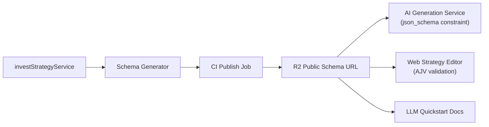
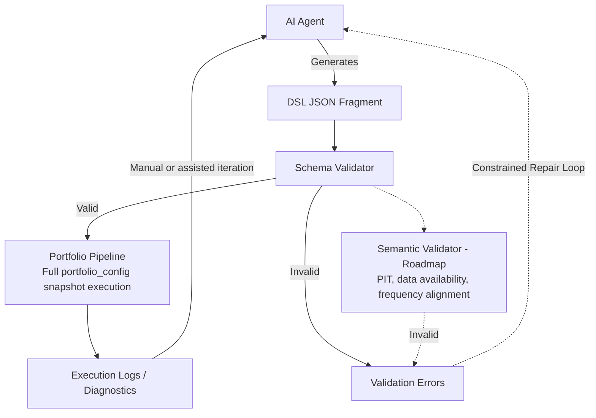
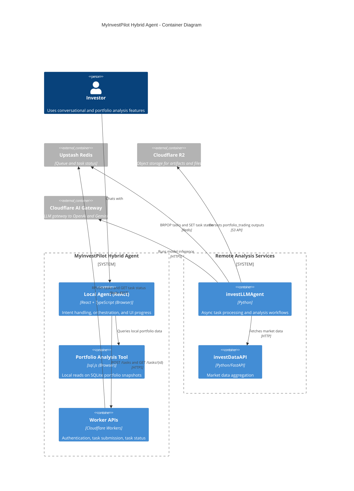

- [Going the Other Direction](#going-the-other-direction)
- [Why Not Code](#why-not-code)
- [Why Not an API](#why-not-an-api)
- [DSL: A Language Designed for AI](#dsl-a-language-designed-for-ai)
  - [Orthogonal Primitives](#orthogonal-primitives)
  - [Schema Supply Chain: Docs as Code](#schema-supply-chain-docs-as-code)
  - [A Real Strategy Example](#a-real-strategy-example)
- [How the Primitives Evolved](#how-the-primitives-evolved)
  - [Stateful Strategies: The Streak Primitive](#stateful-strategies-the-streak-primitive)
  - [External Data Sources: VIX and Market Indicators](#external-data-sources-vix-and-market-indicators)
- [Prompt Engineering: From High Failure Rates to Few-Shot](#prompt-engineering-from-high-failure-rates-to-few-shot)
- [The Agent Paradox: Flexibility vs. Determinism](#the-agent-paradox-flexibility-vs-determinism)
  - [Hybrid Architecture: Local vs. Remote](#hybrid-architecture-local-vs-remote)
  - [From v1 to v3](#from-v1-to-v3)
- [DSL Is Not a Silver Bullet](#dsl-is-not-a-silver-bullet)
- [Looking Back](#looking-back)

A while back I was following a trend-following strategy during a period of extreme market volatility — US-Iran tensions were escalating, and the market was swinging hard. Trend strategies are supposed to chop around in conditions like that. I knew this. But then one morning my stop-loss triggered, I got out, and Trump tweeted something. The market reversed instantly. I sat there watching positions I'd just sold shoot back up.

I wanted to override the strategy. "This situation is different. One manual adjustment won't hurt."

I sat with that feeling for a long time. I understood the logic. I knew trend-following behaves exactly like this in choppy markets. I knew the system worked over time. But when a single night's swing can exceed a month's salary, "I know" stops being enough. You start doubting the strategy. You start doubting yourself. And then you make an emotional decision — which is usually where the real losses come from.

I've seen this pattern over and over. People have strategies and still blow up — not because the strategy was bad, but because they couldn't hold through a rough patch. They know they should be patient but buy the breakout anyway. It's not a knowledge problem. It's that when you don't really understand what your strategy is doing, there's nothing to anchor to when things get uncomfortable.

That's why I built [MyInvestPilot](https://www.myinvestpilot.com/) — an AI-native quantitative investment system that grew out of Chinese market experience but supports global assets (A-shares, US equities, crypto), with an AI strategy lab called [Chat2Invest](https://www.chat2invest.com) for the conversational interface.

## Going the Other Direction

By 2022, almost every "AI + investing" product was doing the same thing: having the AI make decisions on your behalf. Feed it data, get back buy/sell signals, follow along. Clean and simple. But that approach doesn't solve the problem I just described — users still don't know what the system is doing, and when things get uncomfortable, they'll still bail.

MyInvestPilot took the opposite approach: **not having AI replace user judgment, but helping users genuinely understand what they're following.**

Concretely, the core design principle is: AI shouldn't generate strategy *conclusions* directly — it should be guided by strategy *structure*. AI acts as a translator, turning natural language intent into executable, verifiable, reproducible strategy configurations. The engine makes decisions. The model doesn't.

**If you can see what your strategy is doing, you can hold through a drawdown.** A transparent strategy is a strategy you can trust.

## Why Not Code

MyInvestPilot is built for regular investors, not engineers. Users can't write code, so strategy generation has to happen entirely through AI. That constraint shapes everything.

The obvious first move was having AI generate Python strategy code. I tried it. Three problems came up fast:

**Hallucination.** AI invents libraries that don't exist (`import non_existent_pkg`). The code won't run. This is actually the least bad failure — at least it's immediately visible.

**Look-ahead bias.** AI writes code that looks logically sound but uses future data. Backtests look great; live trading falls apart. This one's insidious. In a quant system it's fatal — you can't tell whether the strategy is genuinely effective or just cheating by peeking at the answers.

**Non-reproducibility.** The code generation space is enormous. Given the same strategy intent, AI might produce completely different implementations each time — different variable names, different control flow, different state management. When something breaks, you can't isolate which version caused it, and iterating is a mess.

There's also a practical constraint for a solo product: **sandbox costs**. Running AI-generated code safely requires container isolation, resource limits, timeout handling. Not technically hard, but operationally expensive for a one-person operation.

These problems look different but point at the same thing: the interface is too wide. The more AI can do, the less controllable the output. The problem isn't "the code is wrong" — it's "the boundaries were never defined."

There's one more issue code can't solve: **users can't read it.** Even if the Python runs correctly, a regular investor has no way to understand what it's doing or why it fired a signal. No understanding means no trust. No trust means overriding the strategy at the worst possible moment. The system needs to be executable *and* legible.

After ruling out code generation, I considered the obvious engineering alternative: just build an API.

## Why Not an API

A REST or GraphQL API sounds clean: type-safe, bounded, no sandbox needed.

The problem is expressiveness. APIs are good at describing operations (CRUD). They're not good at describing computation graphs. The moment strategy logic gets at all complex — say, "buy when QQQ relative strength > 101, sell when RS < 99 confirmed over two consecutive days" — expressing that through API parameters turns into deeply nested JSON. Add dynamic position sizing, multi-condition combinations, and external market signals, and the parameter structure explodes.

AI generating that structure burns enormous tokens and makes mistakes constantly on the nesting levels. And every new capability requires API versioning and backward compatibility — a heavy burden for an actively evolving system.

So the Super API approach has the same fundamental problem as code generation, just flipped: code is too free, APIs are too rigid. Neither makes a good interface for AI to reliably express strategy logic.

## DSL: A Language Designed for AI

What I needed was the **safety of an API** combined with the **expressiveness of code**. That's what a DSL (Domain Specific Language) provides.

Instead of having AI write arbitrary code, AI works within a predefined set of building blocks. I define and maintain what blocks are available. AI's job is to translate user intent into combinations of those blocks.

### Orthogonal Primitives

The design principle for primitives is **orthogonality** — each component does one thing, and components can be freely composed. No building a "do everything" component to cover multiple cases.

Take a golden cross strategy. There's no need for a dedicated "golden cross signal" primitive. Three orthogonal primitives compose it:

```
EMA(50)  →  fast line
EMA(200) →  slow line
GreaterThan(fast, slow) → crossover signal
```

The same `GreaterThan` primitive works for comparing any two indicators — no need to design a separate one for each comparison. Fewer blocks, larger composition space.

At the execution level, the primitive system is a **DAG (directed acyclic graph)**, not sequential code. Each primitive is a node; dependencies are edges established through `ref` references; the engine executes in topological order. This works well for AI generation: AI only needs to declare what nodes exist and how they depend on each other. Execution order is automatic.

From [llm-quickstart.txt](https://www.myinvestpilot.com/docs/primitives/_llm/llm-quickstart.txt):

```
🔴 CRITICAL: This is a DEPENDENCY GRAPH system, NOT step-by-step code!

❌ WRONG Mental Model: Sequential execution
   "indicators array executes first, then signals use the results"

✅ CORRECT Mental Model: Directed Acyclic Graph (DAG)
   - Each primitive = NODE with unique "id"
   - Dependencies = EDGES via "ref" in "inputs"
   - Execution order = topological sort (automatic, NOT array order)
```

### Schema Supply Chain: Docs as Code

In MyInvestPilot, Schema is the single source of truth. We don't manually maintain prompts — everything downstream is generated from the same contract.



This solves a problem that had been nagging at me: **how do you keep the docs AI reads in sync with the code the engine runs?**

The traditional answer is manual prompt maintenance — which means docs can go stale any time the engine changes. Now the engine's Schema definition drives CI to generate LLM documentation directly. Same source, always in sync, no drift.

Layered validation is part of the same mechanism:
- **Frontend**: AJV validates JSON structure before it's stored, catching format errors early
- **Backend**: Runtime type checking in the engine
- **Semantic layer**: Targeted consistency checks — point-in-time correctness for fundamental data, market dependency validation

Runtime validation flow:



### A Real Strategy Example

Here's a concrete example. The user's intent: "Use QQQ relative strength to judge market trend — buy when RS > 101, sell when RS < 99 confirmed over two consecutive days."

AI-generated DSL:

```json
{
  "trade_strategy": {
    "outputs": {
      "buy_signal": "rs_above_101",
      "indicators": [
        { "id": "rs_above_101", "output_name": "buy_cond" },
        { "id": "rs_below_99", "output_name": "sell_cond_raw" },
        { "id": "rs_below_99_yesterday", "output_name": "sell_cond_yesterday" },
        { "id": "rs_below_99_confirmed", "output_name": "sell_cond_confirmed" }
      ],
      "sell_signal": "rs_below_99_confirmed",
      "market_indicators": [
        { "market": "QQQ", "output_name": "qqq_rs", "transformer": "qqq_rs_ma200" }
      ]
    },
    "signals": [
      {
        "id": "rs_above_101",
        "type": "GreaterThan",
        "inputs": [
          { "market": "QQQ", "transformer": "qqq_rs_ma200" },
          { "ref": "threshold_buy" }
        ]
      },
      {
        "id": "rs_below_99",
        "type": "LessThan",
        "inputs": [
          { "market": "QQQ", "transformer": "qqq_rs_ma200" },
          { "ref": "threshold_sell" }
        ]
      },
      {
        "id": "rs_below_99_yesterday",
        "type": "Lag",
        "inputs": [{ "ref": "rs_below_99" }],
        "params": { "periods": 1, "fill_value": 0 }
      },
      {
        "id": "rs_below_99_confirmed",
        "type": "And",
        "inputs": [
          { "ref": "rs_below_99" },
          { "ref": "rs_below_99_yesterday" }
        ]
      }
    ],
    "indicators": [
      { "id": "threshold_buy", "type": "Constant", "params": { "value": 101 } },
      { "id": "threshold_sell", "type": "Constant", "params": { "value": 99 } }
    ]
  },
  "market_indicators": {
    "indicators": [{ "code": "QQQ" }],
    "transformers": [
      {
        "name": "qqq_rs_ma200",
        "type": "RelativeStrengthTransformer",
        "params": {
          "field": "Close",
          "window": 200,
          "indicator": "QQQ",
          "reference": "ma"
        }
      }
    ]
  }
}
```

> Paste this JSON into the [visual editor](https://www.myinvestpilot.com/primitives-editor) to see the DAG structure rendered as a graph. To run a backtest, head to the [Chat2Invest community](https://www.myinvestpilot.com/community) and use the strategy lab.

The strategy uses three categories of primitives: external market data (QQQ relative strength), logical comparison (GreaterThan/LessThan), and time delay (Lag). The `Lag` primitive pulls yesterday's signal forward; `And` then requires two consecutive days of confirmation before selling. The full methodology and numbers are in the [signal confirmation case study](https://www.myinvestpilot.com/docs/primitives/advanced/signal-confirmation-case) — this particular example trades TQQQ (3x leveraged QQQ ETF) using QQQ as the signal source, backtested over 2010–2025 with 0.01% transaction costs included.

That's the point of a primitive DSL — not just flexibility, but transparency, constraint, and reproducibility. **Strategy logic stops being something only the model understands, and becomes a structured object that's executable, verifiable, and translatable into human-readable form.**

Users don't see the raw JSON, of course. DSL is the intermediate layer. Above it sits an interpretation layer that renders strategy logic into plain language: what conditions trigger a buy, which indicators it depends on, why a signal fired, how position sizing shifts. The full chain: natural language → AI translates to DSL → engine executes → interpretation layer presents to user → user builds understanding and trust.

The full primitive Schema is public: [primitives_schema.json](https://media.i365.tech/myinvestpilot/primitives_schema.json).

## How the Primitives Evolved

The primitive system wasn't designed all at once. It grew with real requirements.

The initial set covered basic technical indicator primitives (EMA, RSI, MACD) and logical combination primitives (GreaterThan, And, Or) — enough for most trend-following strategies. But orthogonal design has edges it can't reach.

### Stateful Strategies: The Streak Primitive

Some strategies need cross-bar state: "signal only fires after five consecutive days of meeting the condition," or "price must hold above the moving average for three days to confirm a trend." Stateless declarative primitives can't express this. Enter the `Streak` primitive:

```json
{
  "id": "trend_persistence",
  "type": "Streak",
  "params": { "min_length": 5 }
}
```

`Streak` tracks how many consecutive bars a condition has been true, and only outputs true once `min_length` is reached. It's the first primitive in the system with internal state — a deliberate violation of the "fully stateless" design principle. But the tradeoff is worth it: the state is local and predictable, and it solves a real category of strategy needs.

The impact shows up concretely in the [stock-bond rotation case study](https://www.myinvestpilot.com/docs/primitives/advanced/stock-bond-rotation-case). A simple 200-day MA rotation strategy started with a 40% win rate, 1.65% annualized return, and 60 trades over 7 years (2018–2024 A-share backtested data). After adding `Streak` to require five consecutive days of trend confirmation, filtering out false breakouts: win rate climbed to 81.3%, annualized return rose to 5.42%, trades dropped to 16, and profit factor went from 2.5 to 40.69.

Sixty trades down to sixteen, with a much better win rate. The `Streak` primitive didn't add complexity — it added a filter. That's what good composition does.

### External Data Sources: VIX and Market Indicators

Orthogonal design also misses a different category of strategy: **where the signal comes not from the traded asset's own price, but from a third-party market indicator.**

For example, using VIX (the fear index) as a market environment filter — when VIX percentile exceeds 75%, market risk is too high, stop buying. That signal comes from VIX, not from the stock being traded.

The `market_indicators` extension handles this:

```json
{
  "market_indicators": {
    "indicators": [{ "code": "VIX" }],
    "transformers": [
      {
        "name": "vix_percentile",
        "type": "PercentileRankTransformer",
        "params": { "indicator": "VIX", "lookback": 252, "field": "Close" }
      }
    ]
  },
  "trade_strategy": {
    "signals": [
      {
        "id": "market_volatility_low",
        "type": "LessThan",
        "inputs": [
          { "market": "VIX", "transformer": "vix_percentile" },
          { "type": "Constant", "value": 75 }
        ]
      }
    ]
  }
}
```

Signal source and traded asset are now fully decoupled. The same mechanism handles using CSI 300 trend to filter Chinese stock strategies, or VIX percentile to govern US equity exposure.

None of this was planned upfront. The evolution went roughly: basic technical indicators → logical composition → fundamental data → stateful primitives (Streak) → external market indicators (VIX/SPX) → cash sweep to bonds. Each step was pushed by real strategy requirements.

## Prompt Engineering: From High Failure Rates to Few-Shot

Designing a good DSL is one problem. Getting AI to reliably generate valid DSL is a separate one.

Early prompts (v1.1) were simple: give AI a list of primitives, explain the JSON structure, let it generate. Failure rates were high. The errors all shared a common trait: **AI knew what to do, but not what it absolutely couldn't do.**

The most common mistake was inlining signal definitions inside `inputs` instead of defining them first and then referencing them:

```json
// ❌ Actual Gemini error
{
  "id": "buy_cond",
  "type": "And",
  "inputs": [
    {
      "type": "GreaterThan",
      "inputs": [{"column": "Close"}, {"ref": "ma"}]
    }
  ]
}

// ✅ Correct: define first, reference later
{ "id": "price_gt_ma", "type": "GreaterThan", "inputs": [{"column": "Close"}, {"ref": "ma"}] },
{ "id": "buy_cond", "type": "And", "inputs": [{"ref": "price_gt_ma"}] }
```

Another common error: using `And` with three inputs. `And` and `Or` strictly require exactly two. Three conditions require nesting. This is natural in code; AI consistently missed it when generating JSON.

v1.2 added constraint descriptions, with limited improvement. What actually moved the needle was v1.3's two mechanisms:

**ABSOLUTE PROHIBITIONS.** Catalog the most common errors as explicit rules, each paired with a real failure example (including actual Gemini-generated broken code) and the correct alternative. Don't tell AI what to do — tell it what will break the system. The observation behind this: AI under positive guidance tends to ignore boundaries. Under explicit prohibition, it's much more careful.

**Few-shot verified examples.** Include 12 strategy examples in the prompt, graded from simple to complex (Level 1: dual moving average crossover; Level 12: crypto on-chain indicator strategy), each verified against real backtests. AI generating a new strategy can model the closest example rather than reasoning from scratch.

The current [llm-quickstart.txt](https://www.myinvestpilot.com/docs/primitives/_llm/llm-quickstart.txt) is 74KB, with 12 levels of progressive examples covering 97.5% of primitives. It's CI-generated from Schema — every primitive update automatically syncs it.

One more mechanism worth mentioning: **feeding backtest results back to AI.** Strategy execution logs are stored in Cloudflare R2; AI can read them via API and iterate with full context. This turns generation from a one-shot gamble into a generate-validate-revise loop.

## The Agent Paradox: Flexibility vs. Determinism

DSL solved "how to express strategy logic." But MyInvestPilot is a real web product, which means there's another layer: users need to interact with it.

Users don't write JSON. They say "run a backtest on this strategy" or "why has my portfolio's drawdown been increasing?" Translating natural language into structured tasks, then presenting results coherently — that's a different challenge: **how do you let AI understand vague user intent while guaranteeing determinism in financial computation?**

When I say "backtest this strategy," I need deterministic execution. When I ask "why is my drawdown worse lately," I need contextual understanding. That tension is what I've been working through in [Chat2Invest](https://www.chat2invest.com).

### Hybrid Architecture: Local vs. Remote

The solution wasn't a single omniscient agent. I split it into two layers based on engineering constraints — not just for performance distribution, but to explicitly isolate "vague user problems" from "financial computations that must be deterministic." AI can participate in understanding and exploration, but it can't swallow the deterministic infrastructure:

| Property | Local Agent (Orchestrator) | Remote Agent (Processor) |
| :--- | :--- | :--- |
| **Identity** | React component in browser | Worker + Python service |
| **Role** | Handle intent, maintain UI state | Run deterministic pipelines |
| **Logic style** | Flexible ReAct loop | Fixed task pipeline |
| **Data scope** | User interaction, frontend context | Market data, compute tasks, async state |

Full system architecture:



Remote analysis jobs often run for 30+ seconds — synchronous HTTP isn't viable. Redis queues handle async dispatch; the frontend submits and polls. Task payloads are structured JSON:

```json
{
  "job_id": "uuid-123",
  "task_type": "stock_analysis",
  "symbols": ["AAPL"],
  "analysis_context": {
    "user_query": "Is it safe to buy AAPL for me?",
    "time_horizon": "medium_term",
    "focus_areas": ["risk_assessment", "valuation", "entry_timing"]
  }
}
```

The boundary worth being explicit about: **queues and state machines are deterministic; model-generated analysis text is probabilistic. These two layers must not be conflated.**

### From v1 to v3

This structure didn't arrive fully formed. It got there through iteration and failures.

**Phase 1 (Early monolith):** Interaction, tool orchestration, and heavy computation all on one path. The system was unstable, responsibilities blurry. Common symptoms: the agent hallucinating database queries, or trying to return raw HTML to "fix the UI." Lesson: mixing UI concerns with computation concerns amplifies fragility.

**Phase 2 (Plan-Execute):** Explicit planning with step-by-step execution improved local control significantly. But for open-ended conversations, the planning was too rigid and the interaction felt unnatural.

**Phase 3 (CLI Pattern):** Treating the Local Agent as a browser-based CLI + ReAct loop. User states a goal; Local Agent decides whether local tools suffice or it needs to delegate; if delegating, it calls Worker API to enqueue and gets a job ID; Remote Processor executes async; Local Agent polls and updates UI.

The division of labor settled into one sentence: **Local handles ambiguity. Remote handles workload.**

## DSL Is Not a Silver Bullet

At this point I thought the main problems were solved. Then I hit the edges of what DSL could do.

Some strategy logic has complex internal state — multi-timeframe state machines, path-dependent conditions. `Streak` handled simple consecutive-bar state, but more complex stateful logic expressed through declarative DSL gets awkward fast. Forcing it in makes the DSL itself increasingly complex, until it becomes another language users have to learn — the **DSL Hell** I was trying to avoid.

The engine ended up with two paths: the primitive DSL path for 90% of stateless composition logic, and a Python code path for high-complexity stateful cases. Both share the same backtest framework and data pipeline; only the strategy expression layer differs.

That decision saved a lot of headache. If I'd forced DSL to cover everything, it would have swollen into a small programming language by now.

## Looking Back

MyInvestPilot is now roughly 28 repositories, 538k lines of code, and 96 docs, maintained by one person (numbers from `cloc` across all repos, including tests and config). In the [ai-architecture series](https://github.com/myinvestpilot/ai-architecture) I've written about the development methodology — roughly 60% of time on alignment (defining boundaries, contracts, acceptance criteria), 40% on AI execution.

But this post isn't about "how much code AI wrote for me." The real question: when AI enters a serious decision-making system, how should that system be designed?

MyInvestPilot's answer:

```
[ Human strategy intent ]
        ↓
[ AI reasoning / translation / exploration ]
        ↓
[ Primitives engine (executable, verifiable) ]
        ↓
[ Backtesting / simulation / risk assessment ]
```

The primitives engine is the structural core. AI is the translator and exploration tool. Not the decision-maker.

Back to the opening: I didn't override the strategy. Not because I have exceptional self-discipline — because I could see what the strategy was doing, understood why it fired that signal, and recognized that false starts in choppy markets are normal operating cost for a trend-follower. Understanding is the foundation of trust. That's what MyInvestPilot is trying to build.

---

If you're building something similar, a few principles from this experience that travel well:

**Constrain the generation space rather than fixing the output.** Define the blocks AI can use (Schema, DSL) before generation, not after. Catching errors at generation time is far cheaper than debugging them at runtime. This is also why ABSOLUTE PROHIBITIONS worked better than positive guidance — "don't do X" is easier for a model to respect than "you should do Y."

**Docs and execution must share the same source.** Schema drives prompt documentation; the same definition constrains both AI generation and engine execution. Once they drift apart, you get a strange class of bug: "the AI-generated thing won't run" — and it's hard to trace why.

**Separate the deterministic layer from the probabilistic layer.** Queues, state machines, backtest computation — deterministic, must live in code. Natural language understanding, analysis text generation — probabilistic, belongs to the model. Mixing the two layers is the most common architectural mistake in Agent systems.

**In high-stakes systems, the goal isn't producing the right answer — it's helping people build something they can actually follow through on.** I didn't avoid overriding my strategy that day because I have unusual willpower. I avoided it because I could read what the strategy was doing and understood why the stop-loss made sense in context. That's the gap MyInvestPilot is trying to close: not better signals, but a system you can understand well enough to stick with when it's hard.

If you have thoughts on the primitives engine design, the [Chat2Invest community](https://www.myinvestpilot.com/community) is open, or you can try the [visual editor](https://www.myinvestpilot.com/primitives-editor) directly to get a feel for how it works.

Related resources:

- [MyInvestPilot Primitives Documentation](https://www.myinvestpilot.com/docs/primitives/getting-started)
- [Primitives Schema (public)](https://media.i365.tech/myinvestpilot/primitives_schema.json)
- [LLM Quickstart Guide](https://www.myinvestpilot.com/docs/primitives/_llm/llm-quickstart.txt)
- [Signal Confirmation Case Study](https://www.myinvestpilot.com/docs/primitives/advanced/signal-confirmation-case)
- [ai-architecture series (GitHub)](https://github.com/myinvestpilot/ai-architecture)
- [invest-alchemy (early open-source predecessor)](https://github.com/myinvestpilot/invest-alchemy)

---

*This article was written with assistance from OpenCode (Claude Sonnet 4.6), OpenClaw, Codex, Gemini, and Grok.*
