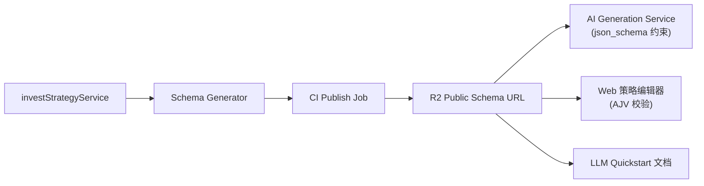
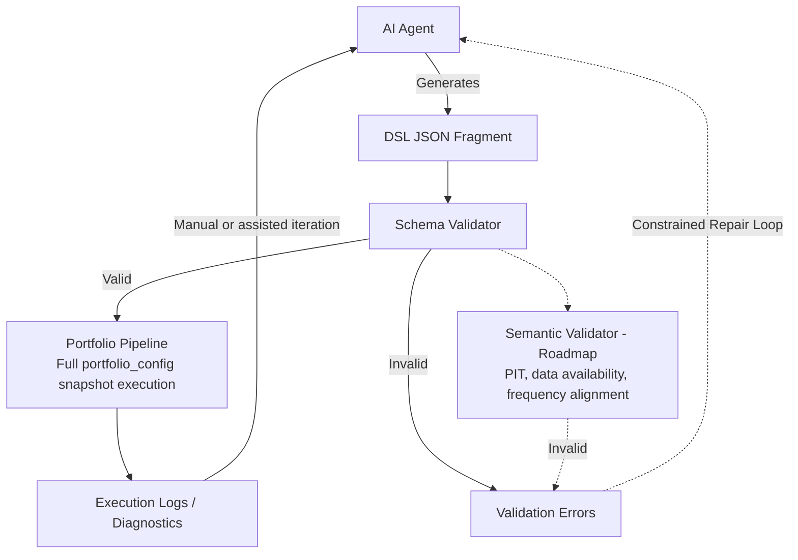
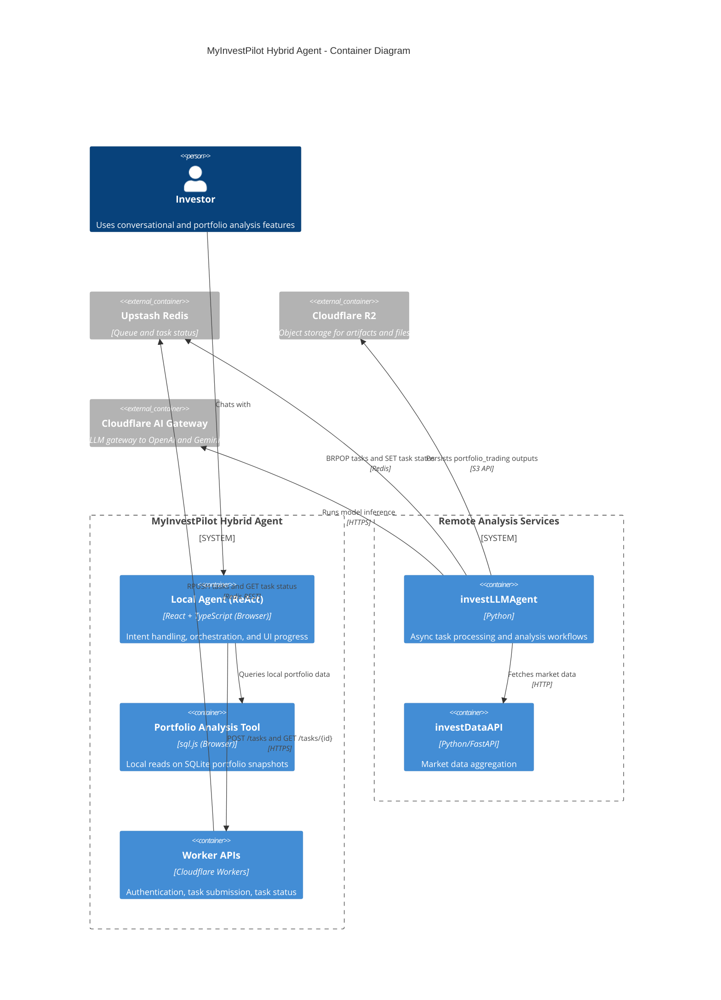

- [一个反方向的选择](#一个反方向的选择)
- [为什么不是代码](#为什么不是代码)
- [为什么不是 API](#为什么不是-api)
- [DSL：给 AI 设计一套专属语言](#dsl给-ai-设计一套专属语言)
  - [正交积木的设计思路](#正交积木的设计思路)
  - [Schema 供应链：文档即代码](#schema-供应链文档即代码)
  - [一个真实的策略示例](#一个真实的策略示例)
- [原语的演化：正交不是终点](#原语的演化正交不是终点)
  - [带状态的策略：Streak 原语](#带状态的策略streak-原语)
  - [外部数据源：VIX 和市场指标](#外部数据源vix-和市场指标)
- [Prompt 的演化：从高失败率到 few-shot](#prompt-的演化从高失败率到-few-shot)
- [Agent 悖论：灵活性与确定性的边界](#agent-悖论灵活性与确定性的边界)
  - [混合架构：Local 与 Remote 的分工](#混合架构local-与-remote-的分工)
  - [从 v1 到 v3 的演进](#从-v1-到-v3-的演进)
- [DSL 不是银弹](#dsl-不是银弹)
- [回头看这件事](#回头看这件事)

> 本文写作过程中借助了 OpenCode（Claude Sonnet 4.6）、OpenClaw、Codex、Gemini、Grok 等工具协作整理。

前段时间跟随一个趋势策略，正好碰上美伊局势紧张，市场剧烈震荡。趋势策略在震荡期本来就会反复试错，我知道这没问题。但有一天开盘止损卖出，然后川普发了一条推文，市场立刻反转拉升。眼睁睁看着刚卖出的仓位涨上去，那种感觉很难受。

我开始想要微操——"这次情况特殊，手动干预一下应该没问题"。

我在那里坐了很久。我理解策略的逻辑，我知道趋势策略在震荡期就是会这样，我也知道长期来看这套系统是有效的。但真金白银放在那里，一晚上的波动可能超过一个月的收入，这种时候"我知道"根本不够用。你会开始怀疑策略，怀疑自己，然后做出情绪化的决策——而这些决策，往往才是真正亏损的根源。

大多数投资者不是输给了市场，而是输给了自己。他们有策略，但在回撤时扛不住；他们知道要长期，但在暴涨时追进去。不是因为不懂道理，而是因为他们看不懂策略在做什么，所以在关键时刻没有足够的信任撑过去。

这就是我构建 [策引（MyInvestPilot）](https://www.myinvestpilot.com/) 的起点。

## 一个反方向的选择

2022 年，市面上几乎所有"AI + 投资"产品都在做同一件事：让 AI 替用户做决策。给它喂数据，它输出买卖信号，用户跟着操作。这条路看起来很顺，但它解决不了上面那个问题——用户仍然不知道系统在做什么，仍然会在关键时刻动摇。

策引选择了一条反方向的路：**不是让 AI 替用户做决策，而是让用户真正理解自己在跟随什么。**

具体来说，策引的核心判断是：AI 不应该直接生成"策略结论"，而应该被"策略结构"所引导。AI 扮演的是"翻译器"——把用户的自然语言意图，翻译成一段可执行、可验证、可复现的结构化策略配置。真正做决策的，是引擎，不是模型。

**你能看懂策略在做什么，才能在回撤时不乱动。** 一个透明的策略，才是一个你能信任的策略。

## 为什么不是代码

策引是给普通投资者用的，不是给程序员用的。用户不会写代码，所以策略生成必须完全由 AI 完成。这个前提决定了一切。

最直觉的想法是让 AI 直接生成 Python 策略代码。我也试过，很快遇到三类问题：

**幻觉**：AI 会幻觉出不存在的库（`import non_existent_pkg`），代码跑不起来。这还是小问题，至少能立刻发现。

**前视偏差（Look-ahead bias）**：AI 会写出看起来逻辑完美、但利用了未来数据的代码。回测结果漂亮，实盘一塌糊涂。这类问题很隐蔽，在量化系统里是致命的——你不知道策略是真的有效，还是在"偷看答案"。

**不可复现**：代码生成的空间太大了。同一个策略意图，AI 每次生成的实现可能完全不同——变量命名不同、逻辑组织不同、状态管理方式不同。你不知道哪次生成的版本出了问题，也很难做版本对比和迭代优化。

除了这三个问题，还有一个对个人产品来说很现实的约束：**沙盒成本**。让 AI 生成的代码在安全环境里执行，需要容器隔离、资源限制、超时处理。技术上不复杂，但运营成本和维护复杂度对一个人维护的产品来说很难接受。

三个问题看起来不同，但都指向同一件事：通用代码接口太宽，AI 能做的事越多，可控性越差。问题不是"写错了"，而是"边界没定义"。

还有一个问题代码解决不了：**用户看不懂**。Python 代码即便跑起来了，普通投资者也无法理解它在做什么、为什么发出这个信号。而看不懂，就没有信任；没有信任，就会在关键时刻乱动。这才是最根本的矛盾——系统要可执行，还要可理解。

放弃代码路线之后，我考虑过另一种更"工程化"的方案：让 AI 直接调用 API 来表达策略逻辑。

## 为什么不是 API

搭一套 HTTP API（REST 或 GraphQL），让 AI 调用接口来表达策略逻辑，看起来是个干净的方案：类型安全、边界清晰、不需要沙盒。

问题在于表达力。API 适合描述操作（增删改查），不适合描述计算图。一旦策略逻辑稍微复杂，比如"QQQ 相对强度大于 101 买入，小于 99 且连续两日确认才卖出"，用 API 参数来表达就会变成深度嵌套的 JSON 迷宫。再加上动态仓位、多条件组合、外部市场信号，参数结构会爆炸式膨胀。

AI 要生成这种结构，token 消耗巨大，而且极容易在嵌套层级里出错。更麻烦的是，每加一种新的策略能力，都要版本化 API、维护向后兼容——这对一个不断演化的系统来说是很重的包袱。

所以 Super API 路线和代码路线一样，都有一个根本性的问题：要么太自由（代码），要么太死板（API 参数），都不是让 AI 稳定生成策略逻辑的好接口。

## DSL：给 AI 设计一套专属语言

我需要的是一套 **API 的安全性** 加上 **代码的表达力** 的东西，这就是 DSL（Domain Specific Language）的意义。

不是让 AI 写任意代码，而是让 AI 在一套预定义的积木里做组合。积木的种类由我来定义和维护，AI 只负责把用户意图翻译成积木的组合方式。

### 正交积木的设计思路

原语（Primitives）的设计原则是**正交**——每个组件只做一件事，不同组件之间可以自由组合，不要设计一个"大而全"的组件来覆盖多种场景。

比如"均线金叉买入"这个策略，不需要一个专门的"金叉信号"原语，而是用三个正交的原语组合实现：

```
EMA(50)  →  计算快线
EMA(200) →  计算慢线
GreaterThan(快线, 慢线) → 判断金叉
```

这种设计的好处是：同样的 `GreaterThan` 原语，可以用来比较任意两个指标，不需要为每种比较场景单独设计原语。积木数量少，但组合空间大。

整个原语系统在执行层是一个 **DAG（有向无环图）**，不是顺序执行的代码。每个原语是图上的一个节点，依赖关系通过 `ref` 引用建立边，引擎按拓扑排序执行。这个设计对 AI 生成很友好：AI 只需要声明"我需要哪些节点、它们之间的依赖关系是什么"，不需要关心执行顺序。

[llm-quickstart.txt](https://www.myinvestpilot.com/docs/primitives/_llm/llm-quickstart.txt) 里对这个模型有一段很直接的说明：

```
🔴 CRITICAL: This is a DEPENDENCY GRAPH system, NOT step-by-step code!

❌ WRONG Mental Model: Sequential execution
   "indicators array executes first, then signals use the results"

✅ CORRECT Mental Model: Directed Acyclic Graph (DAG)
   - Each primitive = NODE with unique "id"
   - Dependencies = EDGES via "ref" in "inputs"
   - Execution order = topological sort (automatic, NOT array order)
```

### Schema 供应链：文档即代码

在策引里，Schema 是唯一的事实源。我们不手工维护 prompt，而是由同一份契约生成所有下游产物。



这套机制解决了一个长期困扰我的问题：**AI 读的说明书和引擎跑的代码，如何保持同步？**

传统做法是手工维护 prompt 文档，但引擎代码一旦更新，文档就可能过期。现在的做法是：引擎的 Schema 定义直接驱动 CI 生成 LLM 文档，两者永远是同一份来源，不存在漂移。

分层验证也是这套机制的一部分：
- **前端**：AJV 校验 JSON 结构，存储前就拦截格式错误
- **后端**：引擎运行时做类型检查
- **语义层**：定向一致性检查，比如基本面数据的时间点一致性（point-in-time）、市场依赖检查

运行时的验证流程：



### 一个真实的策略示例

看一个具体例子。用户的意图是："用 QQQ 的相对强度判断市场趋势，RS > 101 买入，RS < 99 且连续 2 日确认才卖出。"

AI 生成的 DSL（JSON）如下：

```json
{
  "trade_strategy": {
    "outputs": {
      "buy_signal": "rs_above_101",
      "indicators": [
        { "id": "rs_above_101", "output_name": "buy_cond" },
        { "id": "rs_below_99", "output_name": "sell_cond_raw" },
        { "id": "rs_below_99_yesterday", "output_name": "sell_cond_yesterday" },
        { "id": "rs_below_99_confirmed", "output_name": "sell_cond_confirmed" }
      ],
      "sell_signal": "rs_below_99_confirmed",
      "market_indicators": [
        { "market": "QQQ", "output_name": "qqq_rs", "transformer": "qqq_rs_ma200" }
      ]
    },
    "signals": [
      {
        "id": "rs_above_101",
        "type": "GreaterThan",
        "inputs": [
          { "market": "QQQ", "transformer": "qqq_rs_ma200" },
          { "ref": "threshold_buy" }
        ]
      },
      {
        "id": "rs_below_99",
        "type": "LessThan",
        "inputs": [
          { "market": "QQQ", "transformer": "qqq_rs_ma200" },
          { "ref": "threshold_sell" }
        ]
      },
      {
        "id": "rs_below_99_yesterday",
        "type": "Lag",
        "inputs": [{ "ref": "rs_below_99" }],
        "params": { "periods": 1, "fill_value": 0 }
      },
      {
        "id": "rs_below_99_confirmed",
        "type": "And",
        "inputs": [
          { "ref": "rs_below_99" },
          { "ref": "rs_below_99_yesterday" }
        ]
      }
    ],
    "indicators": [
      { "id": "threshold_buy", "type": "Constant", "params": { "value": 101 } },
      { "id": "threshold_sell", "type": "Constant", "params": { "value": 99 } }
    ]
  },
  "market_indicators": {
    "indicators": [{ "code": "QQQ" }],
    "transformers": [
      {
        "name": "qqq_rs_ma200",
        "type": "RelativeStrengthTransformer",
        "params": {
          "field": "Close",
          "window": 200,
          "indicator": "QQQ",
          "reference": "ma"
        }
      }
    ]
  }
}
```

> 可以把这段 JSON 复制到[可视化编辑器](https://www.myinvestpilot.com/primitives-editor)里，看到策略的 DAG 图形化结构；如果想看回测效果，可以去[策引社区](https://www.myinvestpilot.com/community)里用策略实验室做回测实验。

这个策略用到了三类原语：市场外部数据（QQQ 相对强度）、逻辑比较（GreaterThan/LessThan）、时间延迟（Lag）。`Lag` 原语把昨日信号拉进来，再用 `And` 要求连续两日确认，防止假信号触发卖出。2020-2025 年的回测里，这套组合把最大回撤从 -93.83% 降到 -53.96%，同时年化收益达到 27.28%。

这就是原语 DSL 的意义，不只是灵活，而是透明、约束、可复现——**策略不再是一段只有 AI 自己理解的代码，而是一个可执行、可校验、可进一步解释为人类可读形式的结构化对象。**

当然，用户最终看到的不是这段 JSON。DSL 只是中间层——在它之上，还有一层解释层，把结构化的策略逻辑翻译成人类可读的形式：在什么条件下买入、依赖哪些指标、当前信号为什么触发、仓位如何随负债率变化。DSL 的价值不只是让引擎执行，更是给策略解释、[可视化编辑器](https://www.myinvestpilot.com/primitives-editor)和一致性校验提供稳定的中间表示。这条链路才是完整的：自然语言 → AI 翻译成 DSL → 引擎执行 → 解释层呈现给用户 → 用户建立理解与信任。

完整的原语 Schema 公开在这里：[primitives_schema.json](https://media.i365.tech/myinvestpilot/primitives_schema.json)。

## 原语的演化：正交不是终点

原语系统不是一开始就设计完整的，而是随着实际需求不断扩展的。

最初只有基础的技术指标原语（EMA、RSI、MACD 等）和逻辑组合原语（GreaterThan、And、Or 等），这套组合能覆盖大部分趋势跟踪策略。但很快发现，正交设计有它覆盖不到的地方。

### 带状态的策略：Streak 原语

有一类策略需要跨 bar 记忆状态——比如"连续 5 天满足条件才触发信号"，或者"价格连续 3 天高于均线才确认趋势"。这类逻辑用无状态的声明式原语表达不了，需要引入 `Streak` 原语：

```json
{
  "id": "trend_persistence",
  "type": "Streak",
  "params": { "min_length": 5 }
}
```

`Streak` 原语会记录某个条件连续满足的天数，只有达到 `min_length` 才输出真值。这是原语系统里第一个带内部状态的组件，打破了"完全无状态"的设计原则，但这个妥协是值得的——它解决了一类真实的策略需求，而且状态是局部的、可预期的。

`Streak` 原语的价值在实际案例里体现得很清楚。在[股债轮动策略的优化案例](https://www.myinvestpilot.com/docs/primitives/advanced/stock-bond-rotation-case)里，一个基于 200 日均线的简单股债轮动策略，初始胜率只有 40%，年化收益 1.65%，7 年内交易了 60 次——这些数字来自对 2018-2024 年 A 股市场的完整回测。通过引入 `Streak` 原语要求连续 5 天满足趋势强度条件，过滤掉大量假突破信号，最终胜率提升到 81.3%，年化收益 5.42%，交易次数降到 16 次，盈亏比从 2.5 提升到 40.69。

这个案例说明了一件事：原语的价值不在于单个组件有多强，而在于组合之后能产生的过滤效果。质量优于数量，精确打击胜过频繁行动。

### 外部数据源：VIX 和市场指标

另一个正交设计覆盖不到的场景是：**交易信号不由被交易标的的行情决定，而是由第三方市场指标决定。**

比如用 VIX（恐慌指数）来过滤市场环境——当 VIX 百分位高于 75% 时，认为市场风险过高，暂停买入。这个信号来自 VIX，不来自被交易的股票本身。

为此引入了 `market_indicators` 扩展：

```json
{
  "market_indicators": {
    "indicators": [{ "code": "VIX" }],
    "transformers": [
      {
        "name": "vix_percentile",
        "type": "PercentileRankTransformer",
        "params": { "indicator": "VIX", "lookback": 252, "field": "Close" }
      }
    ]
  },
  "trade_strategy": {
    "signals": [
      {
        "id": "market_volatility_low",
        "type": "LessThan",
        "inputs": [
          { "market": "VIX", "transformer": "vix_percentile" },
          { "type": "Constant", "value": 75 }
        ]
      }
    ]
  }
}
```

这套扩展让策略可以引用 VIX、SPX 等外部市场数据，把宏观市场环境纳入交易决策。信号来源和交易标的可以完全解耦——用沪深 300 的趋势来过滤 A 股个股策略，用 VIX 的百分位来控制美股仓位，都是同一套机制。

这些扩展都不是一开始就规划好的，而是在实际策略需求里逐步发现、逐步加入的。现在回头看，原语系统的演化路径大概是：基础技术指标 → 逻辑组合 → 基本面数据 → 带状态原语（Streak）→ 外部市场指标（VIX/SPX）→ 现金扫债券。每一步都是被真实需求推着走的，不是预先设计好的。

## Prompt 的演化：从高失败率到 few-shot

DSL 设计好了，但让 AI 稳定生成合法的 DSL 是另一个问题。

早期（v1.1）的 prompt 很简单：给 AI 一份原语清单，告诉它 JSON 的基本结构，然后让它生成。失败率很高——AI 会犯各种错误，而且这些错误有一个共同特征：**AI 知道"要做什么"，但不知道"不能怎么做"。**

最典型的错误是在 `inputs` 里内联定义信号，而不是先定义再引用：

```json
// ❌ Gemini 实际犯过的错误
{
  "id": "buy_cond",
  "type": "And",
  "inputs": [
    {
      "type": "GreaterThan",
      "inputs": [{"column": "Close"}, {"ref": "ma"}]
    }
  ]
}

// ✅ 正确写法：先定义，再引用
{ "id": "price_gt_ma", "type": "GreaterThan", "inputs": [{"column": "Close"}, {"ref": "ma"}] },
{ "id": "buy_cond", "type": "And", "inputs": [{"ref": "price_gt_ma"}] }
```

另一个常见错误是把 `And` 用成三个输入——实际上 `And` 和 `Or` 严格要求两个输入，三个条件必须用嵌套结构实现。这类约束在代码里很自然，但 AI 在生成 JSON 时很容易忽略。

v1.2 开始加入约束说明，但效果有限。真正让成功率大幅提升的是 v1.3 引入的两个机制：

**ABSOLUTE PROHIBITIONS（绝对禁止项）**：把 AI 最常犯的错误整理成明确的禁止规则，并附上真实的错误示例（包括 Gemini 实际生成的错误代码）和正确写法对比。不是告诉 AI"应该怎么做"，而是告诉它"这样做是致命错误"。这个思路来自一个简单的观察：AI 在"正向引导"下容易忽略边界，但在"明确禁止"下会更谨慎。

**Few-shot 验证策略**：在 prompt 里放入 12 个经过真实回测验证的策略示例，从简单到复杂分级（Level 1 是双均线交叉，Level 12 是加密货币链上指标策略）。AI 在生成新策略时，可以参照最接近的示例来模仿结构，而不是从零开始推理。

现在的 [llm-quickstart.txt](https://www.myinvestpilot.com/docs/primitives/_llm/llm-quickstart.txt) 是 74KB，包含 12 个 Level 的渐进式示例，覆盖了 97.5% 的原语。这份文档由 CI 从 Schema 自动生成，每次原语更新都会同步，不需要手工维护。

除了 prompt 优化，还有一个机制对提升成功率很有帮助：**把回测结果反馈给 AI**。策略执行后，回测日志存储在 Cloudflare R2，AI 可以通过 API 读取这些结果，结合 prompt 上下文做迭代修正。这让 AI 从"一次性生成"变成了"生成-验证-修正"的闭环。

## Agent 悖论：灵活性与确定性的边界

DSL 解决了"策略怎么表达"的问题，但策引毕竟是一个要真正上线的 Web 产品，还有另一个问题没解决："用户怎么跟系统交互"。

用户不会直接写 JSON，他们会说"帮我回测一下这个策略"或者"为什么我的组合最近回撤变大"。把这些自然语言转成结构化任务，再把结果以合理的方式呈现回来，这是另一层挑战：**如何让 AI 既能理解用户的模糊意图，又能保证金融计算的确定性？**

当我说"回测这个策略"时，我需要的是确定性执行；当我问"为什么我的组合最近回撤变大"时，我又需要它能理解用户语境。这个矛盾就是在 [Chat2Invest](https://www.chat2invest.com) 里长期面对的 Agent 悖论。

### 混合架构：Local 与 Remote 的分工

我没有做一个"全能大脑"，而是按工程约束把 Agent 拆成两层。这不只是性能上的分布式拆分，而是为了把"用户的模糊问题"和"金融系统必须保证的确定性"显式隔离——AI 可以参与理解和探索，但不能吞掉确定性基础设施：

| 特性 | Local Agent（Orchestrator） | Remote Agent（Processor） |
| :--- | :--- | :--- |
| **身份** | 浏览器内 React 组件 | Worker + Python 服务 |
| **角色** | 处理模糊意图、维护 UI 状态 | 处理确定性流水线与重计算 |
| **逻辑风格** | 灵活 ReAct Loop | 固定任务管道 |
| **数据范围** | 用户交互、前端上下文 | 市场数据、计算任务、异步状态 |

整体架构如下：



远端分析流程经常超过 30 秒，不能走同步 HTTP 阻塞请求。因此采用 Redis 队列作为异步主干，前端提交任务并轮询状态。提交到队列的任务是结构化 JSON：

```json
{
  "job_id": "uuid-123",
  "task_type": "stock_analysis",
  "symbols": ["AAPL"],
  "analysis_context": {
    "user_query": "Is it safe to buy AAPL for me?",
    "time_horizon": "medium_term",
    "focus_areas": ["risk_assessment", "valuation", "entry_timing"]
  }
}
```

这里有一个边界需要强调：**队列与状态机是确定性的，模型生成的分析文本仍然是概率性的。这两层不能混淆。**

### 从 v1 到 v3 的演进

这套结构不是一开始就对的，而是踩坑迭代出来的。

**Phase 1（早期单体）**：把交互、工具编排、重分析混在一条路径上。结果是系统不稳定，职责边界模糊。常见症状是 Agent 幻觉数据库查询，甚至试图返回原始 HTML"修 UI"。教训：UI 关注点和重计算关注点混在一起，会放大脆弱性。

**Phase 2（Plan-Execute）**：引入了显式 planning + step execution，本地控制力明显提升。但对开放式对话来说，这种计划有时过于刚性，交互体验不够自然。

**Phase 3（CLI Pattern）**：把 Local Agent 视为浏览器里的 CLI + ReAct Loop。用户提出目标，Local Agent 判断是本地工具即可完成，还是需要委托远端；若需远端，调用 Worker API 入队并拿到 job id；Remote Processor 异步执行并更新状态；Local Agent 轮询状态并持续更新 UI。

核心分工最终稳定为一句话：Local 处理模糊性（Ambiguity），Remote 处理工作量（Workload）。

## DSL 不是银弹

做到这里，我以为问题基本解决了。但很快发现 DSL 有它自己的边界。

有一类策略逻辑是带复杂内部状态的——比如需要跨多个时间周期协调的状态机，或者依赖历史路径的复杂条件。`Streak` 原语解决了简单的连续状态问题，但更复杂的状态逻辑用声明式 DSL 表达起来非常别扭，强行塞进去反而让 DSL 本身变得复杂，最后变成另一门需要学习的语言——这就是我想避免的 **DSL Hell**。

所以引擎最终保留了两条路：原语 DSL 路径处理 90% 的无状态组合逻辑，Python 代码路径留给需要复杂状态的高阶场景。两条路共用同一套回测框架和数据管道，只是策略表达层不同。

这个决定让我省了很多麻烦。如果当初强行用 DSL 覆盖所有场景，现在的 DSL 大概已经膨胀成一个小型编程语言了。

## 回头看这件事

策引现在是约 28 个仓库、53.8 万行代码、96 篇文档的系统，由我一个人维护（这个数字来自 `cloc` 对所有仓库的统计，包含测试和配置文件）。在 [ai-architecture 系列](https://github.com/myinvestpilot/ai-architecture)里我记录过这套开发方式：大概 60% 的时间在做对齐（定义边界、契约、验收标准），40% 的时间让 AI 执行。

但这篇文章想说的不是"AI 帮我写了多少代码"，而是：当 AI 介入一个严肃的决策系统时，系统应该怎么设计？

策引给出的答案是：

```
[ 人类策略意图 ]
      ↓
[ AI 推理 / 翻译 / 探索 ]
      ↓
[ 原语引擎（可执行、可验证） ]
      ↓
[ 回测 / 仿真 / 风险评估 ]
```

原语引擎是整个系统的结构核心，而非 AI。AI 在这里扮演的是翻译器和探索工具，不是决策者。

回到开头那个场景：我最终没有微操。不是因为意志力强，而是因为我能看懂策略在做什么，知道它为什么发出那个信号，知道在震荡期这是正常的试错成本。理解，才是信任的基础。这也是策引想做的事。

---

如果你也在构建类似的 AI Native 系统，这套经历里有几条原则我觉得值得带走：

**约束生成空间，优于修复输出。** 与其让 AI 自由生成然后事后校验，不如先定义好它能用的积木（Schema、DSL），把错误拦在生成阶段。ABSOLUTE PROHIBITIONS 比"你应该怎么做"更有效，就是这个道理。

**文档与执行必须同源。** Schema 驱动 prompt 文档，同一份定义同时约束 AI 生成和引擎执行。一旦两者漂移，系统就会出现"AI 生成的东西引擎跑不了"的诡异 bug，而且很难排查。

**确定性层和概率性层必须分离。** 队列、状态机、回测计算——这些是确定性的，必须用代码实现。自然语言理解、分析文本生成——这些是概率性的，交给模型。把两层混在一起，是 Agent 系统最常见的架构错误。

**在高风险决策场景里，系统的目标不是"给出答案"，而是"帮助人建立一套自己能理解、能信任、也能持续执行的决策框架"。** 给出答案很容易，AI 一秒钟能给你十个。但用户在回撤时不乱动、在暴涨时不追高，靠的不是答案，而是对自己选择的理解和信任。这才是策引和普通 AI 投资工具最根本的分野——不是谁的模型更强，而是有人在优化答案，有人在优化纪律。

如果你对原语引擎的设计有想法，欢迎来[社区](/community/)交流，或者直接去试试[可视化编辑器](https://www.myinvestpilot.com/primitives-editor)感受一下这套设计。

相关资料：

- [策引原语文档](https://www.myinvestpilot.com/docs/primitives/getting-started)
- [原语 Schema（公开）](https://media.i365.tech/myinvestpilot/primitives_schema.json)
- [LLM Quickstart Guide](https://www.myinvestpilot.com/docs/primitives/_llm/llm-quickstart.txt)
- [ai-architecture 系列（GitHub）](https://github.com/myinvestpilot/ai-architecture)
- [invest-alchemy（早期开源前身）](https://github.com/myinvestpilot/invest-alchemy)
