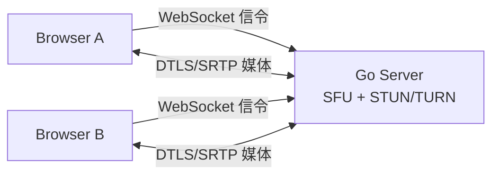
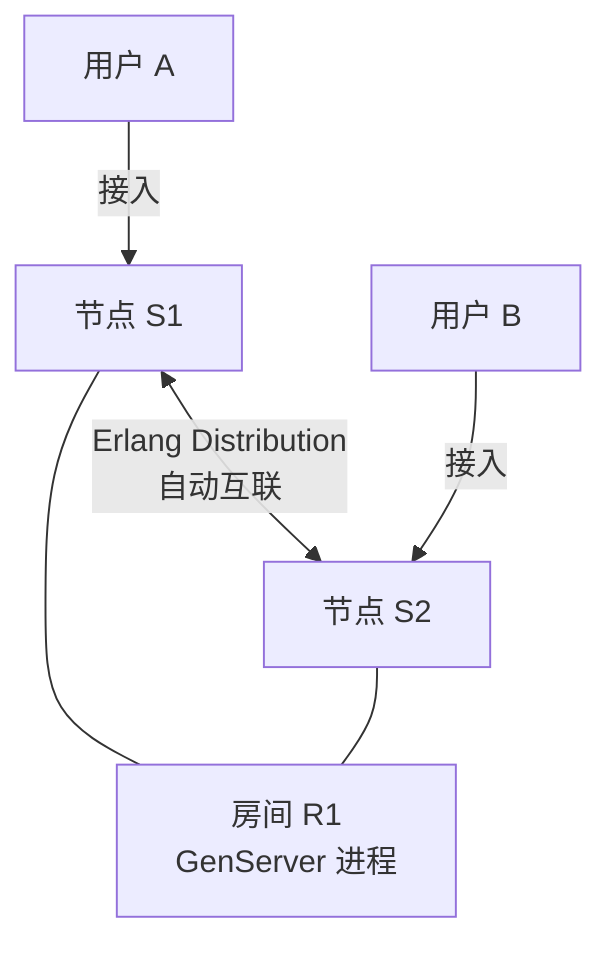
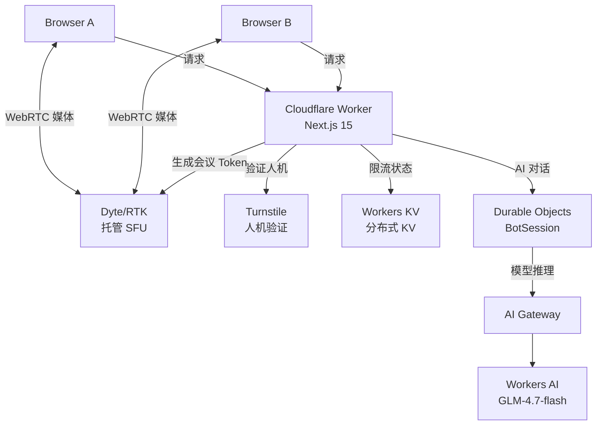
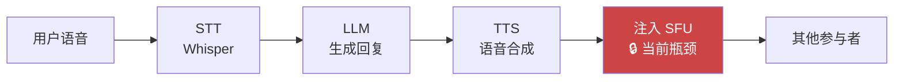

- [为什么要做这件事](#为什么要做这件事)
- [先搞清楚 WebRTC 是什么](#先搞清楚-webrtc-是什么)
  - [信令与媒体的分离](#信令与媒体的分离)
  - [ICE：穿越 NAT 的三种方式](#ice穿越-nat-的三种方式)
  - [DTLS：媒体平面的安全层](#dtls媒体平面的安全层)
  - [SFU vs MCU vs P2P：架构的根本选择](#sfu-vs-mcu-vs-p2p架构的根本选择)
- [第一版：Go + Pion，自建 SFU](#第一版go--pion自建-sfu)
  - [Pion 是什么](#pion-是什么)
  - [架构与局限](#架构与局限)
  - [实测感受](#实测感受)
- [第二版：Elixir + Membrane，集群与文字聊天](#第二版elixir--membrane集群与文字聊天)
  - [为什么换到 Elixir](#为什么换到-elixir)
  - [Erlang/OTP 的集群魔法](#erlangotp-的集群魔法)
  - [新增功能：文字聊天](#新增功能文字聊天)
  - [Elixir 版的边界](#elixir-版的边界)
- [第三版：Cloudflare 全栈，运维归零](#第三版cloudflare-全栈运维归零)
  - [技术栈选型](#技术栈选型)
  - [Durable Objects：每个房间一个 AI 会话](#durable-objects每个房间一个-ai-会话)
  - [Luna：AI 进入聊天室](#lunaai-进入聊天室)
  - [Cloudflare 版的代价](#cloudflare-版的代价)
  - [为什么不自建这些服务](#为什么不自建这些服务)
  - [实测感受](#实测感受-1)
- [三个版本横向对比](#三个版本横向对比)
- [AI 与实时通信的未来方向](#ai-与实时通信的未来方向)
- [总结](#总结)

2022 年初我第一次把 [free4chat](https://github.com/i365dev/free4chat) 发到 V2EX，标题是「搭了一个 WebRTC 语音聊天室，效果惊人」。一台 1 核 1G 的 AWS 服务器，支撑了近千人的并发访问，服务器负载几乎没动。

那之后我把它重写了两次。

不是因为第一版坏掉了——第一版其实一直跑得不错。而是每次重写都在问一个新问题：**如果把运维成本降到零，系统边界在哪里？如果让 AI 进入房间，通信协议需要什么？**

本文是三个版本演进的完整复盘。从 WebRTC 协议栈的基础知识，到三种技术路线的边界，再到 AI 与实时通信结合的未来方向。

## 为什么要做这件事

最初的动机很简单：我需要一个可以随时拉人开会的工具，不需要账号，不需要下载 App，分享一个链接，打开浏览器就能聊。

市面上有 Zoom、腾讯会议、Google Meet，功能都更强，但它们都需要注册。我要的是「用完即走，什么都不留」的极简体验。

这是 [free4.chat](https://free4.chat/) 的核心价值：**无需注册，无需下载，分享链接即开始，关闭标签即结束。**

## 先搞清楚 WebRTC 是什么

在介绍三个版本之前，需要先把 WebRTC 的核心概念说清楚，因为它们直接决定了每个版本的架构选择。

### 信令与媒体的分离

WebRTC 本身**不定义信令协议**。它只负责媒体传输（音频、视频、数据），至于两端如何找到彼此、协商编解码格式，完全交给开发者自己实现，用 WebSocket、HTTP Long Polling 或任何其他方式都可以。

这个设计很反直觉——一个「实时通信协议」却不管「怎么建立连接」。但这也是 WebRTC 的强大之处：信令层是可替换的，媒体层是标准化的。

两端在建立连接时需要交换 **SDP（Session Description Protocol）** 描述符，里面包含了媒体格式、编解码能力、加密参数等信息。这个交换过程就是信令，服务器只是一个「快递员」，把 SDP 转交给对方。

### ICE：穿越 NAT 的三种方式

现实世界里，大多数用户都在 NAT 后面——家里的路由器、公司的防火墙。两端要建立直连并不容易，ICE（Interactive Connectivity Establishment）协议专门解决这个问题。

ICE 会收集三种候选地址（Candidate）：

1. **Host Candidate**：本机局域网 IP。两端在同一局域网时可以直连，延迟最低。
2. **Server Reflexive Candidate（srflx）**：通过 STUN 服务器探测到的公网 IP + 端口。大多数 NAT 环境可以用这种方式穿透。
3. **Relay Candidate（relay）**：通过 TURN 服务器中转。当前两种都失败时的兜底方案，100% 成功但流量经服务器。

STUN 服务器只做一件事：告诉你「你在公网上的地址是什么」，自己不转发数据，几乎没有带宽消耗。TURN 服务器则完全中转媒体流，是真正的带宽消耗点。

实际部署中，需要同时搭 STUN 和 TURN（通常用 coturn）。对于国内网络环境，很多运营商会拦截 UDP 包，relay 模式的使用比例远高于国外。

### DTLS：媒体平面的安全层

WebRTC 的所有媒体流都必须加密，DTLS（Datagram TLS）是运行在 UDP 上的 TLS 变体，用来在两端建立密钥协商。DTLS 握手完成后，实际的音视频数据通过 SRTP（Secure Real-time Transport Protocol）传输。

这保证了媒体流在传输链路上的加密安全——即便流量经过 TURN 服务器中转，TURN 服务器也只能看到加密后的数据包，无法解密内容。

但这也带来了一个约束：**服务端如果想处理媒体流（比如录制、混流、AI 分析），必须参与 DTLS 握手，成为连接的一端**，而不能只是透明转发。这个约束在后面讨论 AI 语音 Bot 时会直接碰到。

### SFU vs MCU vs P2P：架构的根本选择

多人会议的媒体架构有三种模式：

**P2P（Mesh）**：每个参与者直接与其他所有人建立连接，发送 N-1 路流，接收 N-1 路流。连接数是 O(N²)，在人数多时客户端网络和 CPU 负载会爆炸。适合 2-4 人小会议。

**MCU（Multipoint Control Unit）**：服务器接收所有流，解码后混合成一路流再推给每个客户端。每个客户端只有一路上行和一路下行，客户端下行带宽固定且负载低。代价是服务器需要做大量解码+混流+重编码，端到端延迟是三种架构中最高的，服务器成本也最大。

**SFU（Selective Forwarding Unit）**：服务器接收每个客户端的流，选择性地转发给其他客户端，不做解码。每个客户端一路上行，多路下行（每路对应一个参与者）。服务器只转发不处理，成本低；客户端下行带宽随人数线性增长，但可以通过 Simulcast（多码率）缓解。

free4chat 三个版本都用的 SFU 架构，这是语音会议的最优解。

## 第一版：Go + Pion，自建 SFU

### Pion 是什么

[Pion](https://github.com/pion/webrtc) 是 Go 语言实现的 WebRTC 库，也是 Go 生态里 WebRTC 的事实标准。它实现了完整的 WebRTC 协议栈：ICE、DTLS、SRTP、SDP 协商、DataChannel 等。

第一版基于 [kraken](https://github.com/MixinNetwork/kraken)——一个用 Pion 构建的轻量 SFU，前身是 [Mornin.fm](https://github.com/lyricat/mornin.fm) 的后端。信令走 WebSocket，媒体走 WebRTC，服务器同时扮演 STUN/TURN 和 SFU 的角色：

### 架构与局限

整个后端运行在一台 AWS 单实例上，1 核 1G 内存。优势是极度轻量：SFU 不解码媒体，只转发 RTP 包，CPU 消耗极低；Go 的 goroutine 并发模型处理大量 WebSocket 连接也很高效。

局限是**单点**。所有用户必须接入同一台服务器，没有集群扩容机制。如果这台机器挂了，所有房间都断线。

另一个问题是 kraken 本身的内存泄漏（[#32](https://github.com/MixinNetwork/kraken/issues/32)）：断开的连接被标记删除但资源没有真正释放，导致长时间运行后内存持续增长，偶尔需要手动重启。

功能上也只有语音，没有文字聊天，没有文件传输。

### 实测感受

第一版在 V2EX 发布后的那天，近千人访问，创建了上千个房间，1 核 1G 的服务器负载几乎没有变化。这让我对 SFU 架构的效率有了直观的认知——媒体转发本质上是 I/O 密集型，不是 CPU 密集型。

跨国通话（新加坡服务器 ↔ 沙特阿拉伯用户）稳定聊了一小时，语音质量不输 Zoom。对于一台 5 美元/月的 VPS，这个结果让我相当惊讶。

## 第二版：Elixir + Membrane，集群与文字聊天

### 为什么换到 Elixir

Go 版运行稳定，但我不喜欢 Go 的语法，开发效率对我来说不够高。更重要的是，kraken 的单体架构让水平扩容变得困难。

同期我在读 Elixir 和 Erlang/OTP 的资料，越读越觉得这个方向是对的：**Erlang 本来就是为电信级实时通信设计的，集群、容错、进程隔离是语言和运行时的原生能力，不是事后加上去的**。

第二版的 WebRTC 媒体框架换成了 [Membrane](https://membrane.stream/)——Elixir 生态里的多媒体处理框架，提供了对 WebRTC 媒体管道的高层抽象，类似 Pion 在 Go 里的角色。Membrane 可以用 Elixir 原生的进程模型来组织 ICE 协商、DTLS 握手、RTP 转发的各个环节，每一个媒体处理步骤都是一个 Erlang 进程，天然契合 OTP 的 Supervisor 树——某个媒体管道崩溃时，Supervisor 会自动重启它，不会影响其他用户的连接。

### Erlang/OTP 的集群魔法

在大多数语言中，「集群」意味着引入 Kubernetes、Redis Pub/Sub、消息队列等外部中间件。而在 Erlang/OTP 中，集群是开箱即用的：多个节点通过 epmd 自动发现，节点间通过 Erlang Distribution Protocol 互联，进程可以直接跨节点发送消息，本地进程和远程进程在代码层面用法完全一致。

以 free4chat 的场景为例：用户 A 连接到节点 S1，用户 B 连接到节点 S2，两人加入同一个房间。房间在 Elixir 里是一个 GenServer 进程，无论它运行在哪个节点，两个用户都能通过它通信，跨节点消息传递由 OTP 透明处理，代码里完全看不出节点边界：

第二版上了两个节点的集群，用户随机接入任意节点，同一房间的用户可以跨节点存在。这在 Go 版里需要额外的协调层（Redis/etcd）才能做到，在 Elixir 里是自然的。

Erlang VM 还有强大的运行时可观测能力：可以远程 attach 到任意节点的 REPL，查看某个进程的状态、给进程发消息、追踪进程的消息队列，这让调试实时通信问题变得直观很多。

### 新增功能：文字聊天

第二版用一周时间加了文字聊天，技术上是 Phoenix Channels（WebSocket 上的发布订阅机制）。每个房间是一个 Channel，消息广播给房间内所有用户。Phoenix 的 Channel 设计和 WebRTC 的信令层可以共享同一个 WebSocket 连接，不需要额外的连接管理。

### Elixir 版的边界

Elixir 的优势在于集群扩容和状态管理，但它依然是**自建 SFU**。这意味着：

- 需要自己部署和维护 coturn（STUN/TURN）
- 需要管理 AWS EC2 实例，处理系统更新、安全补丁
- 媒体服务器的端口范围（UDP 10000-60000）需要手工配置安全组
- Docker 容器化部署在端口映射上有额外坑

对于个人项目来说，这些运维工作不是致命的，但确实是持续的成本。

## 第三版：Cloudflare 全栈，运维归零

第三版的出发点是一个问题：**如果把运维成本降到零，架构是什么样的？**

Elixir 版的两节点集群已经足够稳定，但 coturn 维护、EC2 安全补丁、偶发的内存问题让我意识到，对个人项目来说，**基础设施本身才是最大的干扰**。于是我开始找一条彻底的出路。

答案是 Cloudflare 全栈。

值得一提的是，第三版是用 [OpenCode](https://opencode.ai/) + Claude Sonnet 4.6 以 vibe coding 的方式在一个周末内完成的，前两个版本都是人工一行行写的。同样的功能量，开发速度的差距是数量级的。这不是本文的主题，但我觉得值得记一笔——AI 辅助开发已经实质性地改变了个人项目的可行边界。

### 技术栈选型

第三版完全跑在 Cloudflare 的产品体系上，每一个功能点都对应一个 Cloudflare 服务：

逐个介绍一下用到的 Cloudflare 服务：

**Dyte（Realtime Kit，以下简称 RTK）**：托管 SFU 服务，负责 WebRTC 媒体的路由、STUN/TURN、媒体服务器。这是第三版最核心的依赖——它把自建 SFU 的所有运维工作外包出去了。我只需要调用 API 创建会议、给用户生成 token，后面的媒体路由全部由 RTK 处理。RTK 有独立的免费额度（按会议分钟数计算），小规模个人项目基本够用。

**Cloudflare Turnstile**：防机器人的人机验证服务，类似 reCAPTCHA 但对用户更友好（大多数情况下无需点击「我不是机器人」）。用户第一次打开 free4chat 时会触发 Turnstile 验证，通过后 token 存入 sessionStorage，后续访问不再重复验证。token 在请求 `/api/token` 时带上，服务端校验通过才能加入房间，防止接口被滥用。

**Workers KV**：Cloudflare 的分布式键值存储，全球边缘节点可读，写入最终一致。free4chat 用它做 IP 维度的访问限流——每个 IP 在 60 秒内最多请求 20 次 token，超限返回 429。KV 的读延迟极低，适合这类高频的限流判断。

**Durable Objects（DO）**：Cloudflare 的有状态计算单元，每个 DO 实例全球唯一，有持久化 KV 存储，可以安全地在单实例里维护状态而不用担心并发冲突。free4chat 用 DO 实现每个房间独立的 AI 会话（BotSession），持久化对话历史（最近 20 条）和每小时调用计数，不同房间的会话完全隔离。

**Cloudflare AI Gateway**：通用 AI 请求代理层，坐在后端模型调用前面，支持代理 Workers AI、OpenAI、Anthropic 等主流模型服务，提供请求日志、缓存、限速、模型回退等能力。BotSession DO 调用 Workers AI 时走 AI Gateway 的 OpenAI 兼容端点，这样可以在 Cloudflare 控制台直接看到每次推理的 token 消耗、延迟和响应内容，调试方便很多。

**Workers AI**：Cloudflare 托管的模型推理服务，模型运行在 Cloudflare 的 GPU 节点上，调用方式兼容 OpenAI API。free4chat 用的模型是 `@cf/zai-org/glm-4.7-flash`，支持中英文对话，响应速度在可接受范围内。Workers AI 的计费是按 token 计算的，小规模使用基本在免费额度内。

### Durable Objects：每个房间一个 AI 会话

DO 是这套架构里最有意思的部分，值得单独说一下它解决了什么问题。

普通的 Cloudflare Worker 是无状态的，每次请求都可能路由到不同的边缘节点，没有办法在请求之间保持内存状态。如果想给每个房间维护一份对话历史，要么存数据库（引入外部依赖），要么每次请求都带上完整历史（浪费带宽）。

DO 解决了这个问题：同一个房间的所有请求都路由到同一个 DO 实例，这个实例有自己的内存和持久化存储，可以安全地在内存里维护对话历史，定期 flush 到存储。每个房间对应一个 BotSession DO，持久化存储最近 20 条消息和每小时调用计数，房间之间完全隔离，不会有竞态条件。

### Luna：AI 进入聊天室

Luna 是 free4chat 内置的 AI 助手。在房间里的文字输入框输入 `@luna 你的问题`，前端拦截这条消息，剥离 `@luna` 前缀后发送到 `/api/bot`，Worker 将其路由给对应房间的 BotSession DO，DO 经由 AI Gateway 调用 Workers AI 生成回复，最终以 `bot` 消息类型展示在聊天面板中。Luna 的回复有上下文记忆，对话历史跨请求持久化，每个房间每小时限 30 次调用。

### Cloudflare 版的代价

Cloudflare 全栈降低了运维成本，但带来了一个根本限制：**无法做服务端音频注入**。

Luna 目前只能做文字回复。如果要让 Luna 以「语音参与者」的身份加入房间、直接说话，需要从服务端向 SFU 注入音频流——服务端必须作为一个 WebRTC 客户端完成 ICE 协商、DTLS 握手，再通过 SRTP 向 SFU 推送 AI 合成的音频。

RTK 是托管 SFU，不暴露底层的 SFU App ID 或 WHIP（WebRTC-HTTP Ingestion Protocol）接口，目前无法从服务端注入音频。这是托管方案的边界：便利性和控制权之间的取舍。

在 Go/Pion 或 Elixir/Membrane 版本中，由于 SFU 是自建的，可以直接让服务端进程作为一个 peer 加入房间，这个能力是完全可以实现的。

### 为什么不自建这些服务

用这么多 Cloudflare 托管服务，不可避免的问题是：如果哪天 Cloudflare 涨价或者某个服务下线，迁移成本会很高。这是真实的风险。

但对一个个人项目来说，现阶段的优先级是**把时间花在产品本身，而不是基础设施**。Turnstile 替代了自己写机器人防护，KV 替代了 Redis + 限流逻辑，AI Gateway 替代了 LLM 代理服务，Durable Objects 替代了状态服务器，Workers AI 替代了自己部署 GPU 节点——这些每一项自建都需要额外的维护成本。

更重要的是，这套组合的月费用在小规模使用下接近零，大部分都有慷慨的免费额度。对个人项目来说，用托管服务换运维时间是合算的。

### 实测感受

上线后的一个周末，我用屏幕共享模式直播了约两小时，房间里最多十几个人，到最后剩几个人，全程线路稳定，没有断流。对于一个完全跑在 Cloudflare 边缘、没有任何自建媒体服务器的方案，这个稳定性让我相当满意。

和第一版「1 核 1G 扛住近千人并发」相比，第三版的验证维度不同：不是极限并发，而是持续时长和屏幕共享这个带宽密集型场景的稳定性。两次不同角度的实测，都印证了托管 SFU 在个人项目场景下的可靠性。

## 三个版本横向对比

| 维度 | Go + Pion（第一版） | Elixir + Membrane（第二版） | Cloudflare + RTK（第三版） |
|---|---|---|---|
| **SFU 控制权** | 完全自建，完全控制 | 完全自建，完全控制 | 托管，无底层控制 |
| **集群扩容** | 手工实现，复杂 | OTP 原生，极简 | 托管，无需关心 |
| **运维成本** | 中（服务器 + coturn） | 中高（多节点集群） | 极低（近零） |
| **AI 语音注入** | **可实现** | **可实现** | 不可实现（RTK 不暴露 WHIP）|
| **开发效率** | 中（Go 生态完善） | 高（Elixir 表达力强） | 高（边缘函数简单） |
| **调试体验** | 一般 | 优（LiveDashboard + remote REPL） | 一般（Worker 日志） |
| **月成本（小规模）** | ~$5-10 | ~$10-20（双节点） | ~$0-5（按量付费） |
| **适合场景** | 学习 WebRTC 底层、需要定制 SFU | 生产集群、高并发、需要 AI 语音 | 个人项目、零运维、快速上线 |

**选择建议：**

- **想理解 WebRTC 底层、需要完全控制 SFU**：Go + Pion。代码量少，WebRTC 逻辑清晰，适合学习和定制。
- **要做生产级实时通信、未来需要 AI 语音 Bot**：Elixir + Membrane。集群天然支持，服务端 peer 注入技术上可行，Erlang 的容错能力是最强的。
- **个人项目、快速验证、不想管服务器**：Cloudflare + RTK。运维归零，边缘部署延迟低，文字 AI 助手开箱即用。

## AI 与实时通信的未来方向

AI 与实时通信的结合正处于早期阶段，但方向已经比较清晰。

**当前可做的（文字层）**：AI 助手参与文字聊天，上下文感知，总结会议内容，回答问题，执行指令。free4chat 的 Luna 就是这个阶段。

**近期可期的（语音层）**：语音 Bot 的核心链路是 STT → LLM → TTS，最后注入 SFU。Cloudflare Workers AI 上已经有 Whisper（STT）和 TTS 模型，前三步理论上可以在 Worker 内完成。卡住的是最后一步——媒体注入，需要 RTK 开放 WHIP 接口或 Cloudflare 开放 WebRTC 媒体注入能力。截至本文写作时（2026 年 5 月），Cloudflare 的 Calls API 和 Agents SDK 中已出现了相关能力的雏形，但还未对普通开发者全面开放。

**更远期的方向（多模态层）**：AI 不只是房间里的一个「话筒」，而是一个真正的参与者。

会议效率低的一个核心原因是信息不对称——参会者准备不足，或者讨论到某个话题时缺少相关背景知识，导致讨论浅尝辄止、无法深入。如果 AI 带着组织的内部知识库实时接入会议，在讨论卡壳时主动补充上下文、提供数据支撑、召唤相关文档，会议就不再受限于「在场人员的知识边界」。这比「会后总结」要有价值得多——它在讨论还活着的时候介入，而不是事后打扫战场。

另一个方向是一对一的语音陪伴场景：心理咨询、情感支持、职业辅导。这类对话的核心需求是实时、连续、有情感响应，而不是问答式的文字交互。大模型的语言理解能力已经可以支撑这类场景，卡点同样在媒体注入和端到端延迟——需要控制在 800ms 以内，才能让对话节奏接近真人交流。

实时翻译、自动生成结构化会议纪要这些功能反而是相对容易的，技术上已经可行，主要是工程整合问题。真正难的是「主动介入」——AI 判断什么时机该说话、说什么、说多少，这涉及对话状态建模，比生成一段回复复杂得多。

## 总结

三个版本做下来，我对「技术选型」这件事有了更直观的理解：**没有最好的技术栈，只有边界最匹配的技术栈**。

Go + Pion 给了我 WebRTC 最清晰的学习路径，代码少，协议直接可见。Elixir 给了我对分布式状态管理最深的理解，OTP 的集群模型是真正优雅的设计。Cloudflare 全栈让我看到了运维成本可以接近零的未来，但托管 SFU 的控制权损失是真实的代价。

前两个版本人工写，第三版 vibe coding 一个周末完成——开发速度的差距是数量级的。Cloudflare 的产品体系和 AI 辅助开发加在一起，让「一个人在业余时间维护一个有实际功能的产品」这件事变得真正可持续。

如果你想体验现在的版本：[https://free4.chat](https://free4.chat/)

如果你对技术细节感兴趣，三个版本都在同一个仓库的不同分支：[https://github.com/i365dev/free4chat](https://github.com/i365dev/free4chat)

- `golang` 分支：Go + Pion 版
- `elixir` 分支：Elixir + Membrane 版
- `cloudflare` 分支（默认）：当前 Cloudflare 全栈版

## 延伸阅读

- [Real-time Web应用开发新体验](/dev/real-time-web/) — 本站关于 Elixir 实时 Web 开发的深度介绍
- [WebRTC for the Curious](https://webrtcforthecurious.com/) — WebRTC 协议栈的开源书，从协议层讲起，非常适合想理解底层的读者
- [Pion WebRTC Examples](https://github.com/pion/webrtc/tree/master/examples) — 用 Go 理解 WebRTC 各个功能的最好起点
- [Phoenix LiveView: The Road to 2 Million Connections](https://www.phoenixframework.org/blog/the-road-to-2-million-websocket-connections) — Elixir Phoenix 单机 200 万并发 LiveView 连接的压测报告
- [Durable Objects 官方文档](https://developers.cloudflare.com/durable-objects/) — 理解 DO 一致性模型和 SQL storage 迁移路径的必读参考
